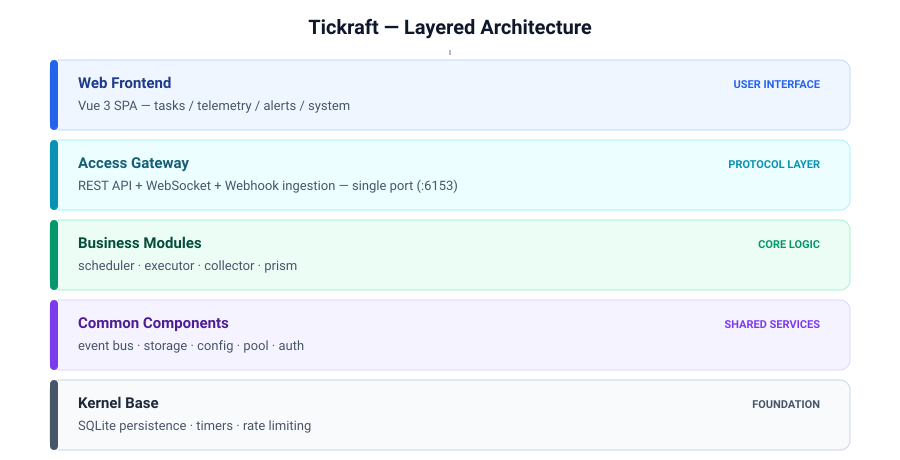
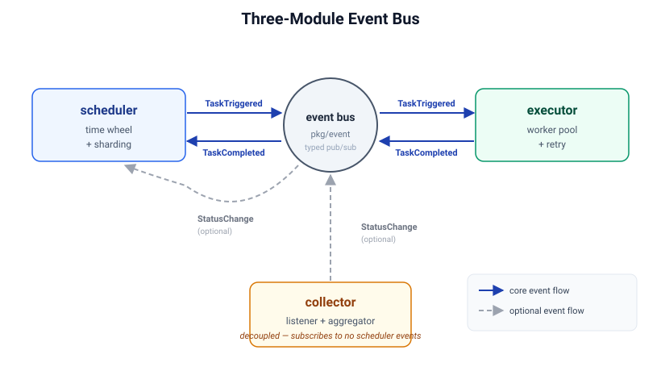

# Architecture

## Overview

Tickraft ships as a single self-contained binary that bundles the REST API, the Vue 3 single-page application, the scheduling engine, the execution engine, the collection engine, and the alerting engine. It persists state in an embedded SQLite database and has zero external runtime dependencies, so a single `tickraft start` process is enough to run the entire product.

The runtime is organised into three independent subsystems — **scheduler**, **executor**, and **collector** — that never import each other. All cross-module communication flows through a strongly typed event bus, which keeps each subsystem independently replaceable and testable.

## Layered architecture

A single HTTP listener (`server.addr`, default `:6153`) serves every protocol: the JSON API under `/api/v1/*`, webhook ingestion under `/webhook/*`, the health probe at `/healthz`, and the SPA assets at `/`. There is no multi-port deployment mode in the open-source edition.

## Three-module architecture

The scheduler, executor, and collector are deliberately decoupled. They share no Go packages, call no methods on each other, and coordinate exclusively by publishing typed events.

### scheduler — pure scheduling engine

The scheduler is responsible only for deciding *when* a task should run:

- **Task metadata** — registration, updates, deletion, and an in-memory cache of task definitions.
- **Triggering** — a hierarchical time wheel combined with cron expressions computes the next firing time and publishes a `TaskTriggered` event when it is due.
- **Sharding** — a shard manager decides whether the current node owns a given task, so multiple instances can split work without duplicate execution.
- **Dependency tracking** — downstream tasks only fire after their upstream dependencies complete successfully.
- **Event-driven triggers** — the scheduler subscribes to `TaskCompleted` to update dependency state and to `StatusChange` to trigger event-driven tasks.

The scheduler never imports the executor package; it has no knowledge of *how* a task is executed.

### executor — task execution engine

The executor subscribes to `TaskTriggered`, looks up the right executor implementation, runs it, and publishes a `TaskCompleted` receipt.

- **Worker pool** — a bounded semaphore caps concurrent executions (default 100); when saturated the work degrades to inline execution rather than spawning unbounded goroutines.
- **Retry** — retry count and interval are read from the task metadata and applied transparently.
- **Status inference** — the result of each execution is mapped to a resource status (`Normal` / `Abnormal`).
- **Executor registry** — executors register by `Type()` and are classified as `Actuator` (write actions: `local`, `webhook`) or `Prober` (read-only probes: `icmp`, `tcp`, `http`, `udp`, `dns`).

### collector — data collection engine

The collector ingests externally reported data and is fully decoupled from the scheduler — it subscribes to no scheduler events.

- **Listener SPI** — passive receivers model every ingestion channel (webhook, syslog, SNMP trap, MQTT, …) as a `Listener`.
- **Validator** — inbound reports are checked for structural correctness, asset existence, tenant ownership, and size limits.
- **Aggregator** — metrics are bucketed into fixed tumbling windows and reduced to avg / max / min / count / sum statistics.
- **Persistence** — metrics and logs are batched into the stores.
- **Built-in HTTPListener** — an out-of-the-box HTTP endpoint with HMAC-SHA256 signature or asset-key authentication.

## Event bus

The event bus (`pkg/event`) is the only communication channel between the three modules. It offers strongly typed publish/subscribe via generics, so event payloads are checked at compile time.

| Event             | Publisher  | Subscriber        | Purpose                                  |
|-------------------|------------|-------------------|------------------------------------------|
| `TaskTriggered`   | scheduler  | executor          | A task is due; the executor should run it. |
| `TaskCompleted`   | executor   | scheduler         | Execution finished; update dependencies.   |
| `StatusChange`    | collector  | scheduler (optional) | A resource changed state; fire event-driven tasks. |

The collector never subscribes to scheduler events, which guarantees the collection engine can run in isolation.

## Data flows

1. **Schedule → execute** — the time wheel fires → `TaskTriggered` published → executor runner consumes → executor runs (with retry) → status inferred → `TaskCompleted` published → scheduler updates dependencies → execution record persisted.
2. **Ingest → persist** — external report → listener receives → validator checks → processor determines status → state manager detects change → aggregator windows the metrics → persistence batch-writes metrics and logs.
3. **Event-driven** — collector emits `StatusChange` → scheduler subscribes → triggers an associated event-driven task → flows into the schedule → execute path.

## Common components

- **config** (`pkg/config`) — loads YAML, interpolates environment variables (`${VAR}` / `${VAR:-default}`), and validates the file before startup.
- **pool** (`pkg/pool`) — a unified goroutine pool manager. Every concurrent task in the system (executors, notifications, maintenance loops, listeners) submits through it; bare `go` statements are forbidden.
- **db** (`pkg/db`) — the storage abstraction over SQLite. Business modules read and write through this layer rather than issuing raw SQL.
- **alert / prism** (`pkg/alert`, `pkg/prism`) — the alerting engine subscribes to alert events, matches them against rules, and dispatches notifications through pluggable channels (the open-source edition ships a webhook channel).
- **auth** (`pkg/auth`) — JWT issuance, token blacklist, and the built-in admin user.

## Persistence model

The open-source edition persists all state in a single SQLite file. Every business table carries a `tenant_id` column that enables row-level isolation; even though the open-source edition is single-tenant by default, the column is present so downstream extensions can enable multi-tenancy without a schema migration. Database schema is managed by GORM `AutoMigrate` at startup — there is no hand-written migration SQL to maintain.

## Related documents

- [Deployment](./deployment.md) — binary, Docker, and development deployment.
- [Configuration](./configuration.md) — every configuration field explained.
- [Getting started](./getting-started.md) — from zero to first task in five minutes.
- [User guide](./user-guide.md) — walkthrough of every screen in the web UI.
- [Extension guide](./extension-guide.md) — how to add executors, listeners, channels, and API plugins.
- [Module boundaries](./module-boundary.md) — the rules that keep the three modules decoupled.
- [OpenAPI specification](./api/openapi.yaml) — REST API paths and schemas.
