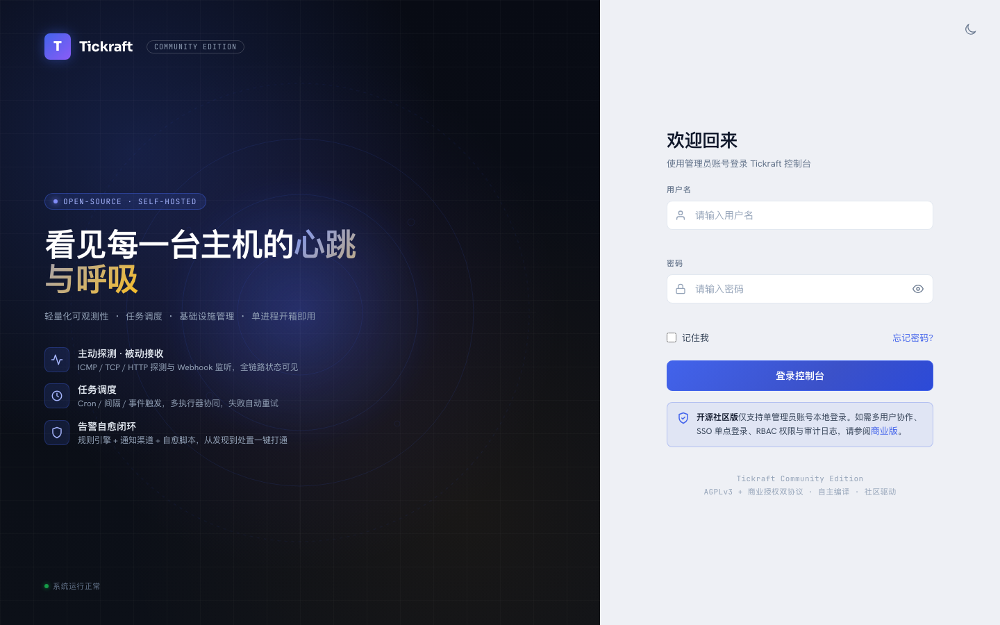
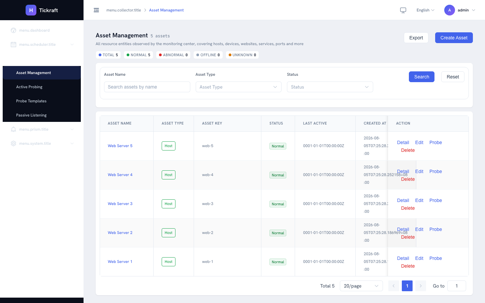
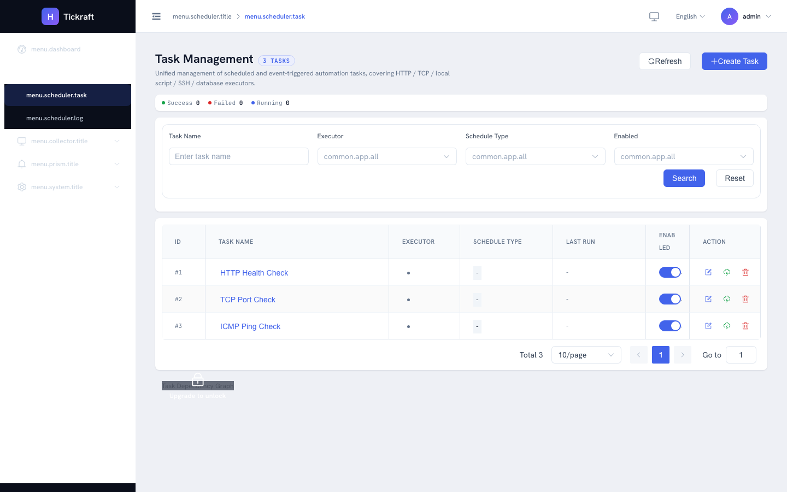
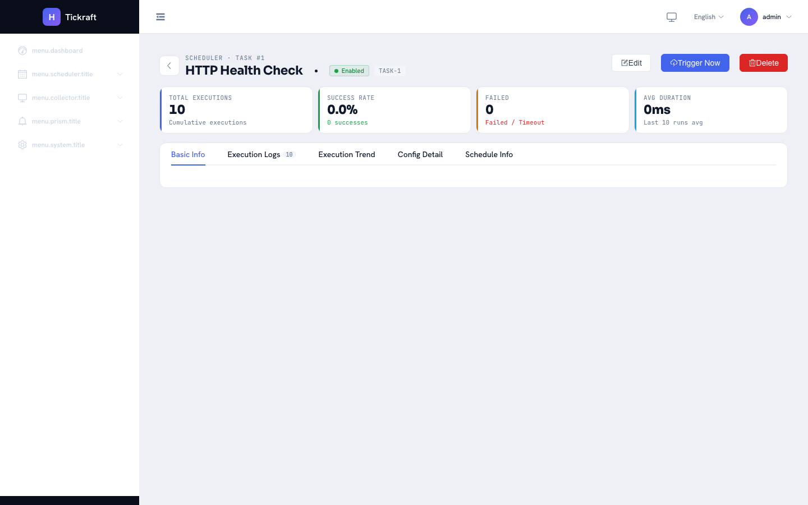
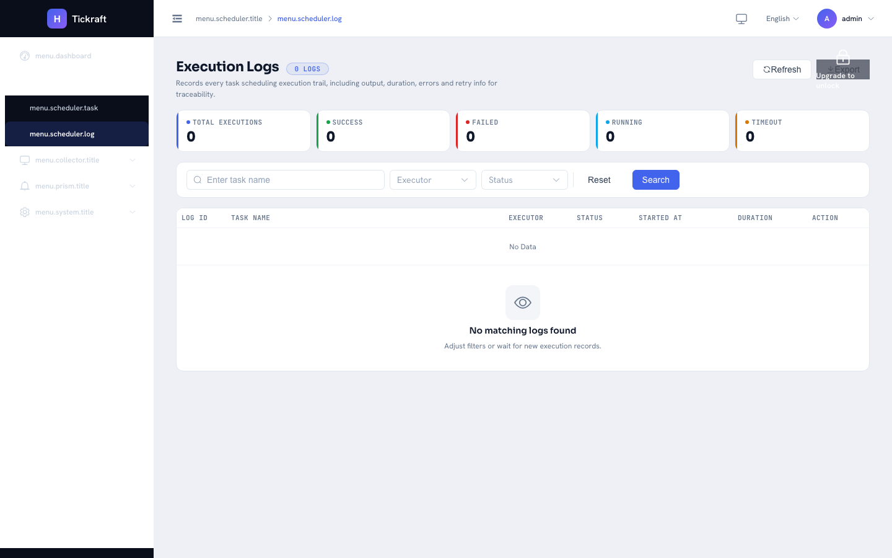
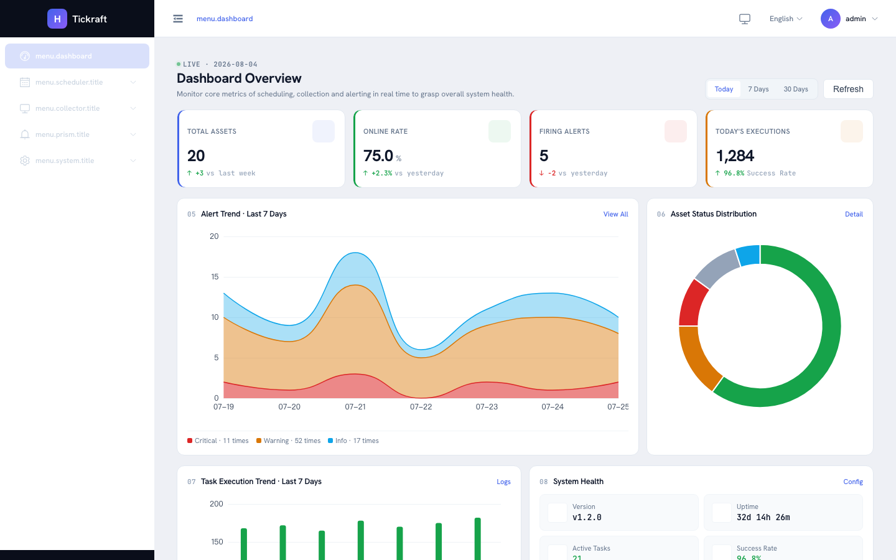

# 快速开始

> 本中文文档仅供参考，请以英文文档为准。
> Chinese translation is for reference only; the English documentation is authoritative.

本指南将带你从一份干净的代码检出开始，在大约五分钟内运行起一个 Tickraft 实例，并创建你的第一个调度任务。

## 前置条件

- **Go** 1.26 或更高版本（用于构建后端）。
- **Node.js** 18 或更高版本以及 **pnpm** 8 或更高版本（仅当你想运行前端开发服务器时需要）。
- 支持 SQLite 的文件系统 —— SQLite 已内嵌，无需外部数据库服务器。

## 第 1 步 —— 构建二进制

```bash
git clone https://github.com/tickraft/tickraft.git
cd tickraft
go build -o bin/tickraft ./cmd/tickraft
```

二进制文件输出到 `bin/tickraft`。

## 第 2 步 —— 准备配置

复制示例配置并进行编辑：

```bash
cp configs/config.example.yaml config.yaml
```

至少设置以下三个环境变量，以便配置文件能够进行插值：

```bash
export TICKRAFT_DB_DSN="sqlite:///tmp/tickraft.db"
export TICKRAFT_JWT_SECRET="$(openssl rand -hex 32)"
export TICKRAFT_ADMIN_PASSWORD="admin"
```

> `TICKRAFT_ADMIN_PASSWORD` 是内置 `admin` 用户的密码。首次登录时系统会要求你修改它。

启动前先校验配置：

```bash
./bin/tickraft config validate -c config.yaml
```

## 第 3 步 —— 启动服务器

```bash
./bin/tickraft start --config config.yaml
```

服务器默认监听 `http://localhost:6153`。在浏览器中打开它。

## 第 4 步 —— 登录

1. 访问 `http://localhost:6153`。
2. 使用用户名 `admin` 以及你在 `TICKRAFT_ADMIN_PASSWORD` 中设置的密码登录。
3. 首次登录时会强制你修改密码 —— 选择一个强密码并确认。



## 第 5 步 —— 注册资产

在 prober 或 listener 上报数据之前，需要先把目标注册为资产。

1. 在侧边栏打开 **监测中心 → 资产**。
2. 点击 **创建**，填写名称和资产 key（例如 `web-1`），然后保存。
3. 记下该资产 key —— 上报遥测数据时会用到它。



## 第 6 步 —— 创建你的第一个任务

创建一个每分钟检查一次 URL 的 HTTP 探测任务。

1. 打开 **任务调度 → 任务**，点击 **创建**。
2. 选择 `http` executor。
3. 设置目标 URL（例如 `https://example.com`）。
4. 选择 `interval` 调度类型，并将间隔设置为 `60s`。
5. 保存并启用任务。

任务会立即触发一次，之后每 60 秒触发一次。打开任务详情即可实时查看执行记录。




## 第 7 步 —— 查看执行日志

打开 **任务调度 → 日志**，即可查看所有任务每一次执行的状态、耗时和输出。



## 第 8 步 —— 浏览仪表盘

仪表盘将资产状态、任务成功率和近期告警汇聚到一个视图中。



## 后续步骤

- **[用户指南](./user-guide.md)** —— 逐步介绍 Web UI 中的每个页面。
- **[配置](./configuration.md)** —— 详解每一个配置字段。
- **[架构](./architecture.md)** —— scheduler、executor 与 collector 如何协同工作。
- **[扩展指南](./extension-guide.md)** —— 添加自定义的 executor、listener 和通知渠道。

## 故障排查

**端口 6153 已被占用。** 使用 `lsof -i :6153` 检查监听进程，要么停止冲突的进程，要么在 `config.yaml` 中修改 `server.addr`。

**`config validate` 报告某变量未设置。** 每一个没有 `:-default` 的 `${VAR}` 都必须存在于环境中。请导出该变量或为其添加默认值。

**首次登录失败。** 确认启动服务器的那个 shell 中已经导出了 `TICKRAFT_ADMIN_PASSWORD`。当该密码环境变量为空时，服务器会生成一个随机密码并在启动时记录一次日志 —— 请检查启动日志。

**UI 无法访问 API。** SPA 与 API 由同一个端口提供服务，因此生产环境中不存在 CORS 问题。在开发模式下（`pnpm run dev` 运行在 5173 端口），Vite 代理会把 `/api` 转发到后端 —— 请确保后端正在 `vite.config.ts` 中配置的端口上运行。
