# 功能使用手册

> 本中文文档仅供参考，请以英文文档为准。
> Chinese translation is for reference only; the English documentation is authoritative.

本指南将逐屏介绍 Tickraft Web UI 的每个界面。每一节都会说明该页面的用途、使用方法以及需要注意的要点。所有截图均取自使用 mock 数据运行的开源版。

## 目录

- [登录与认证](#登录与认证)
- [仪表盘](#仪表盘)
- [Scheduler](#scheduler)
  - [任务列表](#任务列表)
  - [创建任务](#创建任务)
  - [任务详情](#任务详情)
  - [执行日志](#执行日志)
- [Collector](#collector)
  - [资产](#资产)
  - [Prober](#prober)
  - [Listener](#listener)
- [Prism](#prism)
  - [告警记录](#告警记录)
  - [告警规则](#告警规则)
  - [自愈](#自愈)
- [系统](#系统)
  - [配置项](#配置项)
  - [API 密钥](#api-密钥)
  - [系统信息](#系统信息)
- [开源版限制](#开源版限制)

---

## 登录与认证

登录页是进入控制台的入口。使用内置的 `admin` 用户，以及通过 `TICKRAFT_ADMIN_PASSWORD` 配置的密码（或启动日志中自动生成的密码）登录。

**首次登录。** 首次登录时会强制修改密码。请设置一个强密码并确认，随后会跳转到仪表盘。

**后续登录。** 完成首次密码修改后，登录表单会直接接受新密码。勾选"记住我"可将 session token 保存到本地存储；不勾选则仅在浏览器会话期间保留 token。

**Token 刷新。** access token 在 `auth.token_ttl`（默认 24 小时）后过期。前端会使用 refresh token 自动刷新。若两者均过期，将跳转回本页。

## 仪表盘

仪表盘是登录后的落地页，将系统整体健康状况汇总到一个视图中：

- **统计卡片** — 任务总数、被监控资产数、今日执行数、今日成功率。
- **任务成功率趋势** — 展示过去 24 小时成功率变化的折线图。
- **资产状态分布** — 正常与异常资产的数量分布。
- **最近告警** — prism 引擎最近触发的告警记录。

点击任一卡片或图表可下钻到对应模块。

## Scheduler

scheduler 模块管理周期性与事件驱动的任务。每个任务都定义了*执行什么*（executor 类型 + 配置）、*何时执行*（调度计划）以及*失败时的处理*（重试策略）。

### 任务列表

任务列表以分页表格形式展示所有已注册任务。每行展示任务名、executor 类型、调度计划、启用开关、上次运行时间、下次运行时间以及快捷操作。

**筛选。** 使用搜索栏按名称筛选，或使用下拉筛选器按 executor 类型、调度类型或启用状态缩小范围。

**快捷操作。** 每行提供以下按钮：
- **触发** — 立即运行任务（忽略调度计划）。
- **启停** — 启用或停用任务。
- **复制** — 克隆任务配置创建新任务。
- **编辑** — 打开任务编辑器。
- **删除** — 删除任务（需确认）。

点击任务名可打开其[详情页](#任务详情)。

### 创建任务

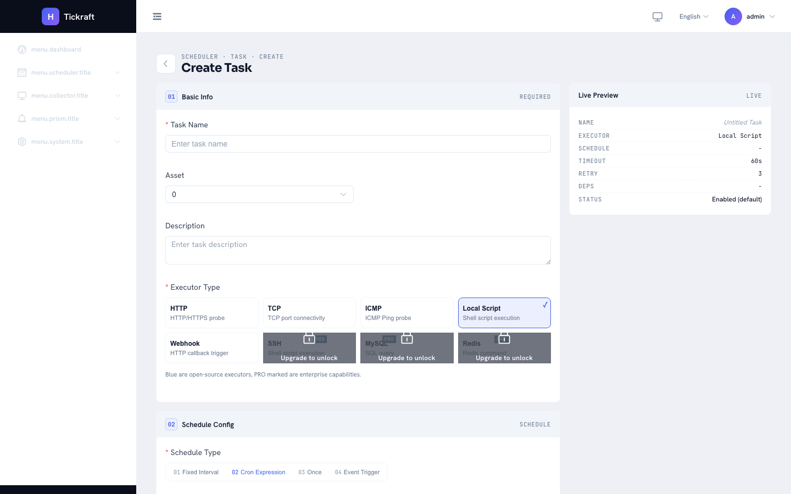

创建页是一个分段的表单：

1. **基本信息** — 名称、描述、优先级与标签。
2. **Executor** — 选择 executor 类型（`http`、`tcp`、`icmp`、`udp`、`local`、`webhook`）。表单会根据所选 executor 动态展示相关字段（例如 `http` 对应 URL + 方法，`tcp` 对应 host + port）。
3. **调度计划** — 选择调度类型：
   - `interval` — 每 N 秒运行一次。
   - `cron` — 按 cron 表达式运行（例如 `*/5 * * * *`）。
   - `once` — 在指定时刻运行一次。
   - `event` — 当依赖任务完成或状态变更事件触发时运行。
4. **重试** — 针对临时性失败的最大重试次数与重试间隔。
5. **依赖** — 对于事件驱动任务，选择在触发本任务前必须完成的任务。

点击 **保存** 注册任务。任务会立即按其调度计划开始执行。

### 任务详情

详情页展示完整的任务配置及其最近的执行历史：

- **头部** — 任务名、executor 徽标、启用开关以及操作按钮（编辑、触发、暂停/恢复、删除）。
- **配置摘要** — 以只读形式展示所有任务参数。
- **执行历史标签页** — 该任务最近执行的列表，显示状态、耗时、输出和时间戳。点击某条执行可查看其[日志详情](#执行日志)。

### 执行日志

日志列表展示**所有**任务的执行记录。每行包含任务名、executor 类型、状态（`success`、`failed`、`timeout`、`running`）、耗时、重试次数以及开始/结束时间。

**筛选。** 按任务名、executor 类型、状态或时间范围筛选以缩小结果集。

点击某行可打开[日志详情](#执行日志)页，查看完整输出与错误信息。

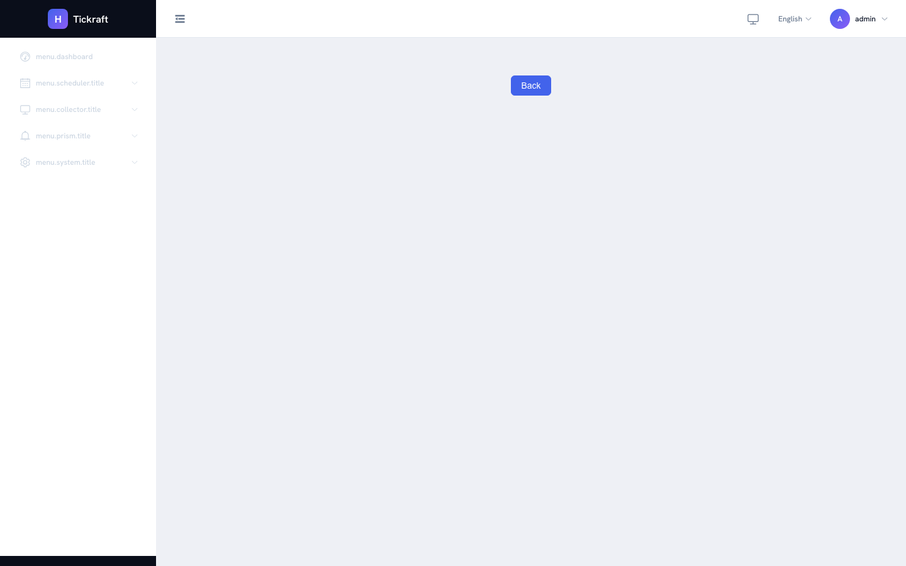

日志详情页展示完整的执行输出、错误信息（如有）、重试历史与时间分解。点击 **重试** 按钮可重新执行该任务。

## Collector

collector 模块从两类来源采集监控数据：**prober**（Tickraft 主动发出的探测）与 **listener**（接受外部上报的被动接收器）。两者都汇入资产状态机。

### 资产

资产即任何被监控的目标 — 主机、服务、网络设备等。在 prober 或 listener 上报数据之前，目标必须先注册为资产。

**创建资产。** 点击 **创建**，填写资产名、asset key（用于 webhook 上报的唯一标识）、类型以及可选的元数据。

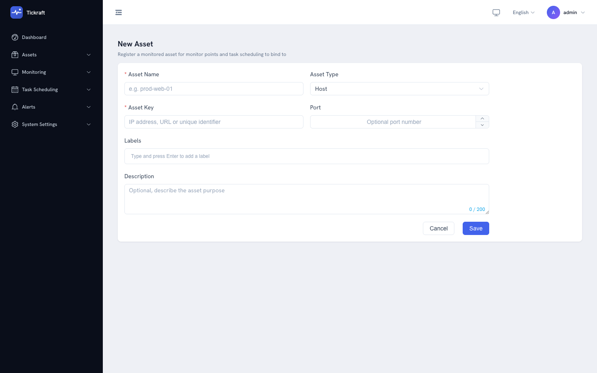

**资产详情。** 点击资产行可查看其详情页，展示当前状态、最近遥测数据、关联的 prober 以及用于上报数据到该资产的 webhook 端点。

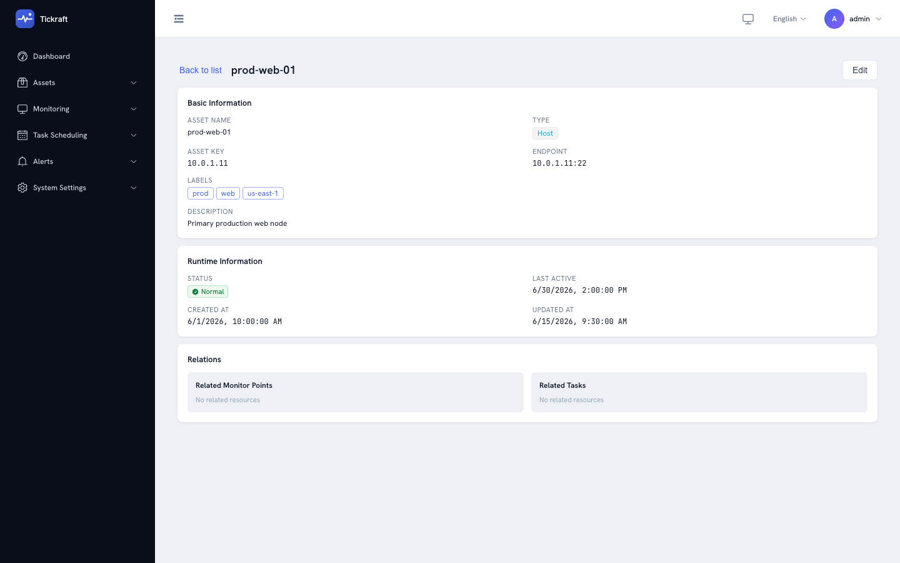

### Prober

prober 是按调度计划主动探测目标的监控任务。开源版内置四种 prober 类型：`icmp`、`tcp`、`http` 与 `udp`。

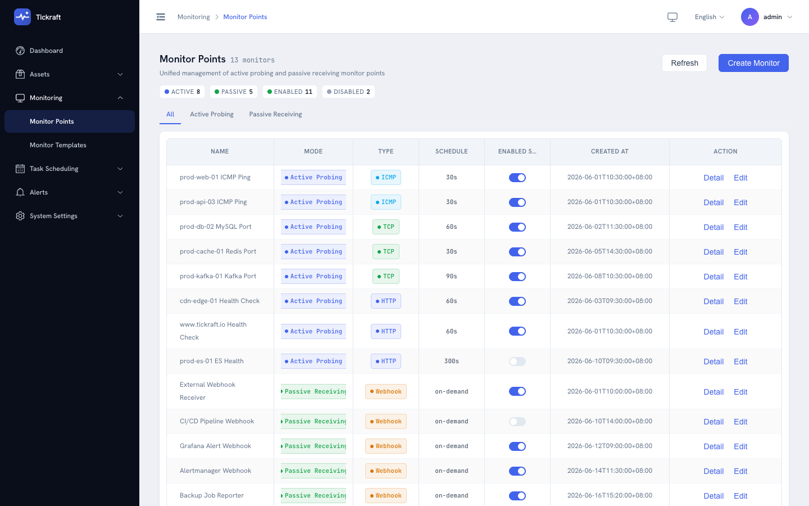

prober 列表展示每个已配置的 prober、其目标资产、探测类型、间隔、当前状态以及最近结果。

**创建 prober。** 选择 prober 模板（ICMP、TCP、HTTP、UDP），选择目标资产，配置探测参数，并设置调度计划。

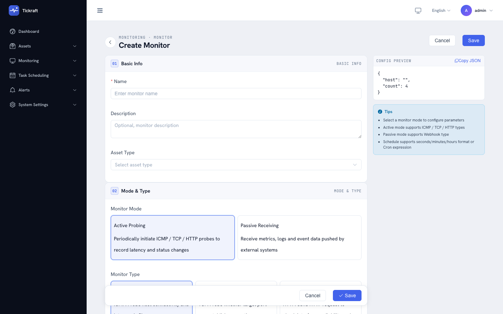

**Prober 详情。** 详情页展示 prober 配置、最近探测结果，以及响应时间或状态随时间变化的趋势图。

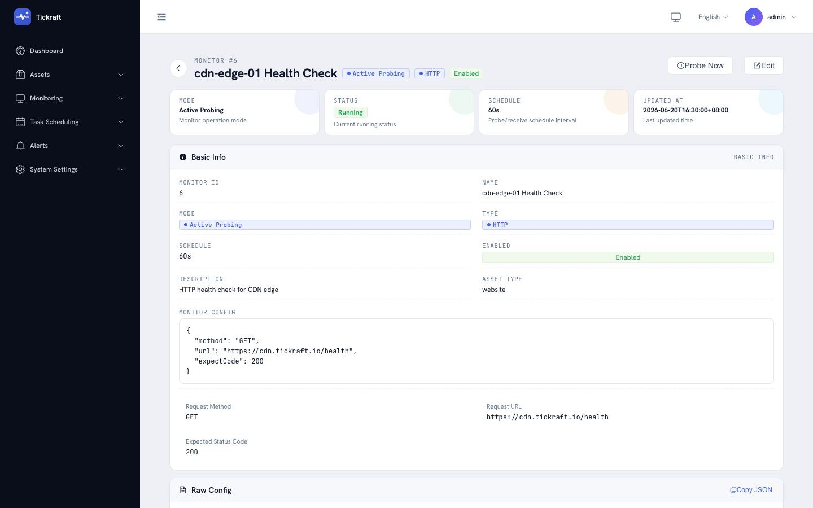

### Listener

listener 是接受外部遥测上报的被动接收器。开源版内置 HTTP（webhook）listener。

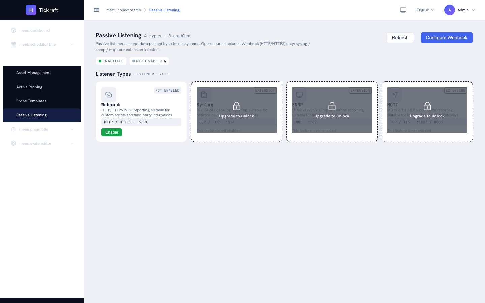

listener 概览页列出每个已配置的 listener、其类型、状态以及已接收的上报数。

**Webhook listener。** webhook 配置页展示接收端点 URL、预期的鉴权方式（`X-Tickraft-Asset-Key` 请求头）以及示例 payload。外部系统可向该端点 POST 遥测数据以更新资产状态。

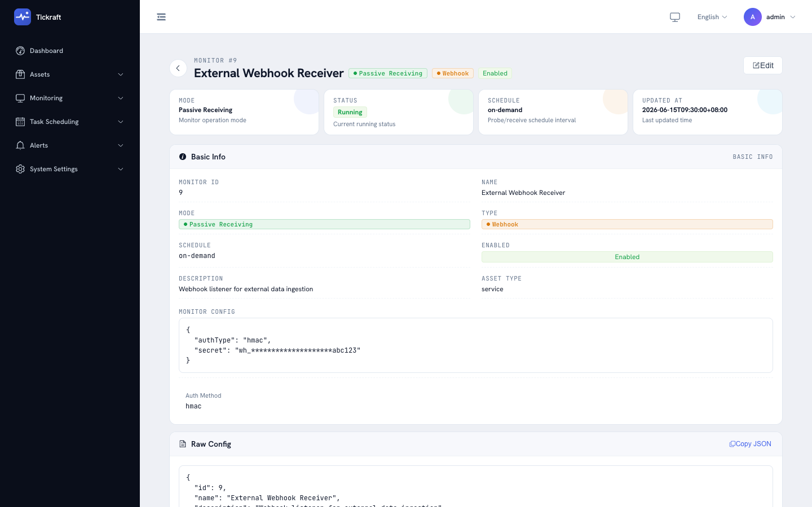

## Prism

prism 模块是告警与自愈引擎。它基于进入的遥测数据评估告警规则，在规则匹配时触发告警记录，并可触发自愈动作。

### 告警记录

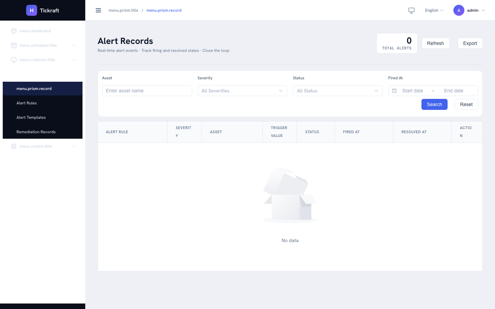

告警记录列表展示每一条已触发的告警。每行包含规则名、严重级别（`info`、`warning`、`critical`）、状态（`firing`、`acknowledged`、`resolved`）、触发告警的值、消息以及时间戳。

**操作。** 对于 `firing` 状态的告警：
- **确认** — 标记告警已被查看；停止重复通知。
- **解决** — 手动关闭告警。

点击某条记录可查看其详情，包括完整的规则表达式、评估值以及通知历史。

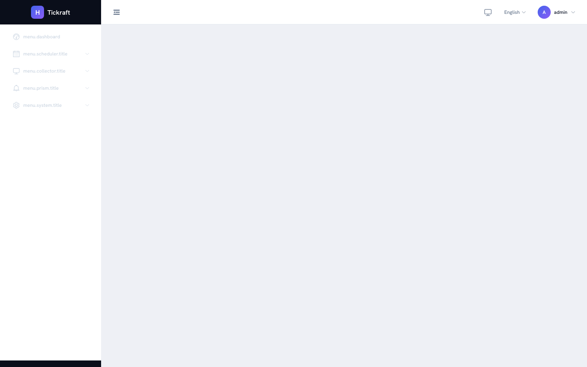

### 告警规则

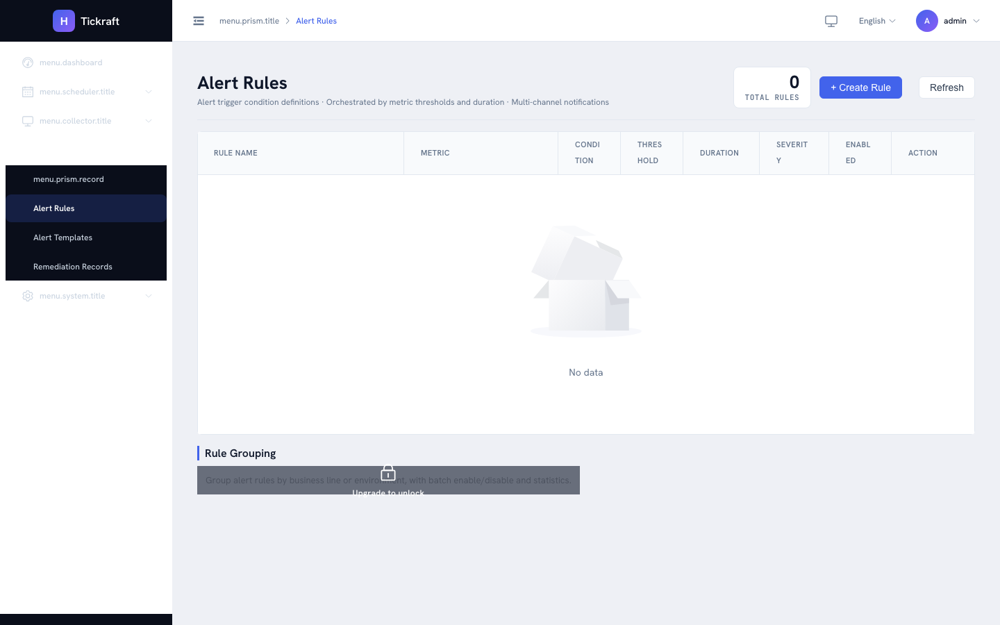

告警规则列表展示每条已配置的规则。每行展示规则名、场景（`task`、`probe`、`metric`、`remediation`）、优先级以及启用开关。

**创建或编辑规则。** 规则编辑器允许使用 `expr-lang` 表达式定义告警条件，选择场景，设置严重级别，并启用/停用规则。

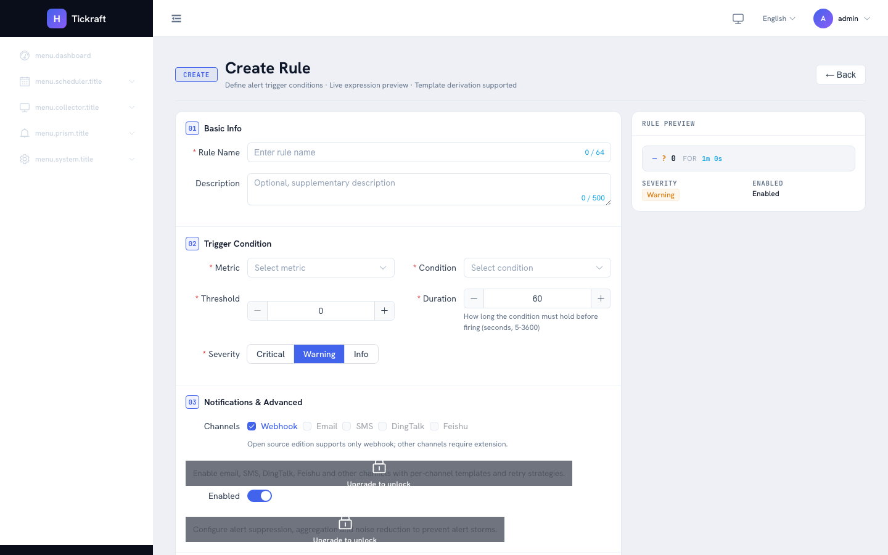

### 自愈

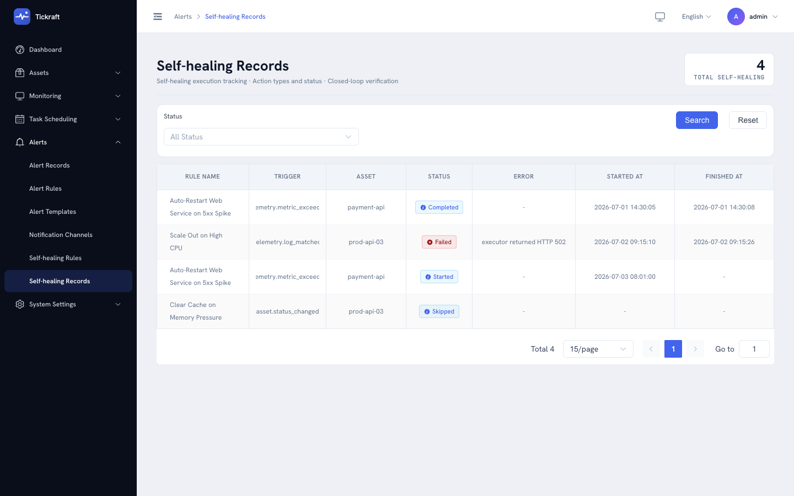

自愈列表展示在特定告警条件满足时触发的自动化自愈动作。每行展示自愈名称、触发条件、动作类型以及上次执行状态。

开源版最多支持 5 条自愈动作。参见[开源版限制](#开源版限制)。

## 系统

### 配置项

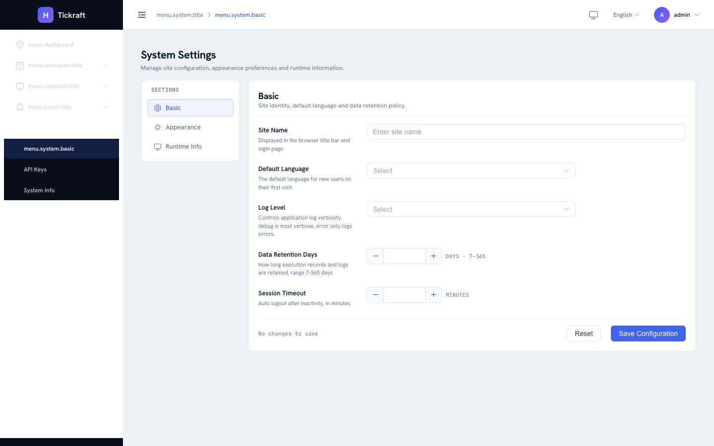

配置项页暴露运行时配置：
- **日志级别** — `debug`、`info`、`warn` 或 `error`。
- **默认语言** — UI 的回退语言。
- **保留天数** — 自动清理前保留历史日志与遥测数据的天数。

日志级别与语言的修改立即生效；保留天数由后台维护扫描任务应用。

### API 密钥

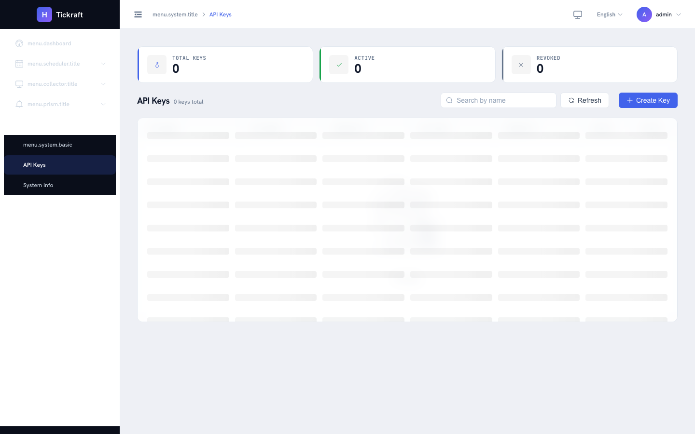

API 密钥用于让外部系统对 REST API 进行鉴权。每个密钥包含名称、前缀（显示前 8 个字符）、创建日期、最近使用时间戳以及可选的过期时间。

**创建密钥。** 点击 **创建**，输入名称并选择可选的过期时间（30 / 90 / 365 天，或永不过期）。完整密钥**仅显示一次** — 请立即复制。

**吊销密钥。** 点击密钥行的删除按钮可吊销该密钥。被吊销的密钥仍保留在列表中以供审计，但无法再用于鉴权。

### 系统信息

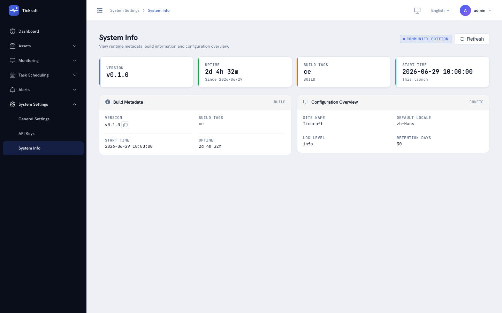

系统信息页展示运行时元数据：
- **版本** — 构建版本与构建标签。
- **启动时间** — 服务进程启动的时间。
- **运行时长** — 服务已运行的时长。

可通过本页确认部署的版本以及服务是否发生意外重启。

## 开源版限制

开源版通过软性配额确保单进程的资源占用可预测。重新编译源码即可解除这些限制。

| Resource              | Quota   |
|-----------------------|---------|
| Monitored assets      | 20      |
| Probers               | 20      |
| Scheduled tasks       | 20      |
| Remediation actions   | 5       |
| HTTP probe interval   | 60 s    |
| Telemetry events/day  | 100 000 |

当达到配额时，UI 会显示限制提示。已存在的项目继续运行；仅阻止新建项目。

## 相关文档

- [快速开始](./getting-started.md) — 五分钟从零到第一个任务。
- [配置](./configuration.md) — 每个配置字段的详细说明。
- [架构](./architecture.md) — scheduler、executor 与 collector 如何协作。
- [扩展指南](./extension-guide.md) — 添加自定义 executor、listener 与 channel。
- [部署](./deployment.md) — 二进制、Docker 与开发部署。
